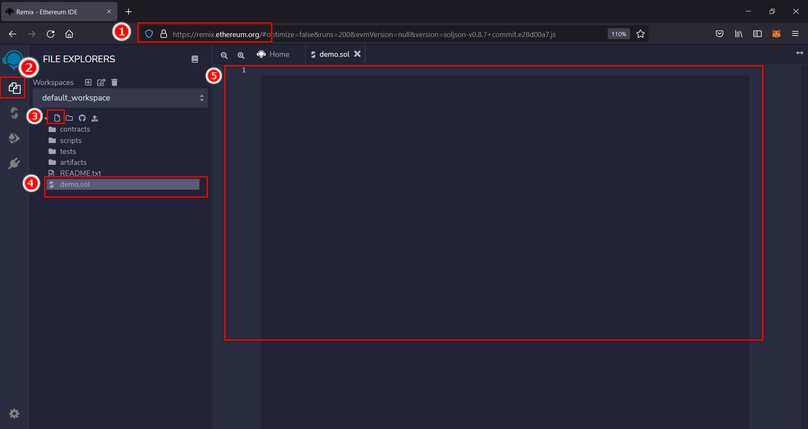
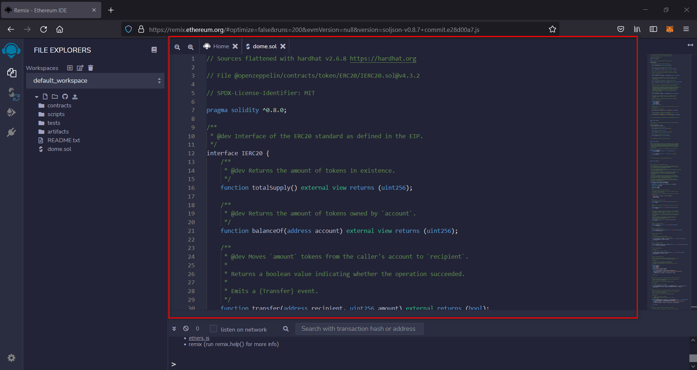
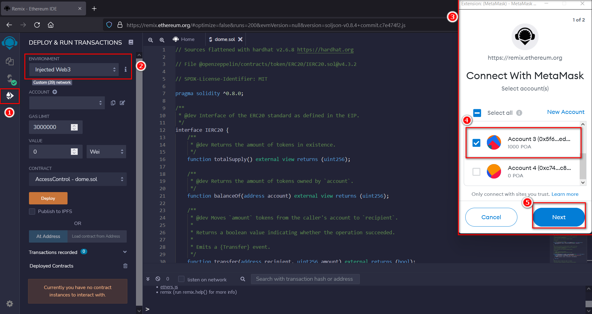
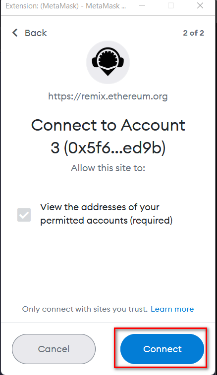
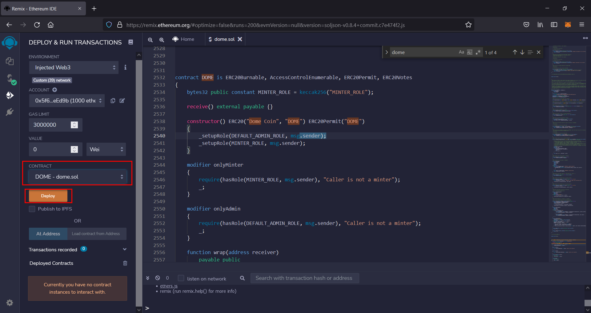

# Demo Samrt Contact Remix 
> https://remix.ethereum.org

## 1. เปิด Remix

## 2. copy code จาก dome.sol
copy source code จากไฟล์ dome.sol ไปวางในกล่องข้อความที่ 5 ตามรูปตัวอย่าง

## 3. Solidity compiler
เลือกเมนู Solidity compiler เลือก version compiler ใน source code ใช้ version 0.8.4

## 4. Deploy & RUN
เลือกเมนู Deploy & run transactions จากนั้นเลือกที่ Environment เลือก Injected Web3 จะมีหน้าต่าง metamask ขึ้นมาให้เลือก account และที่จะ deploy
ต่อมาคือ Contract ให้เลือก Contract DOME - dome.sol และกด Deploy

