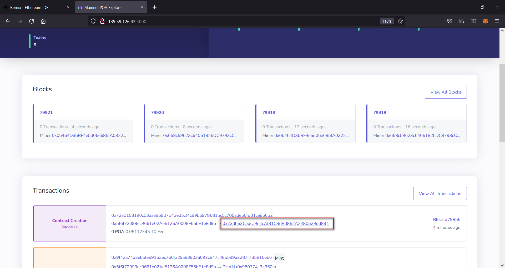
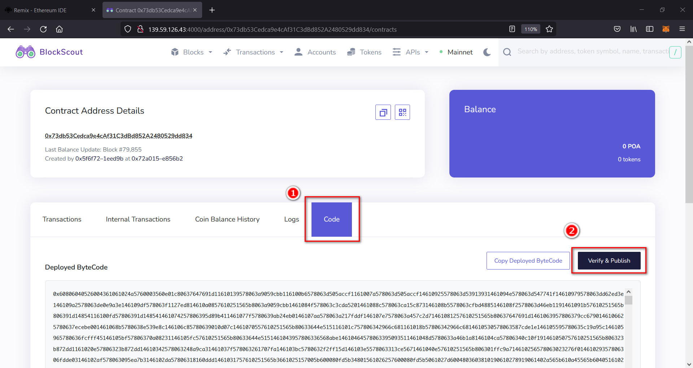
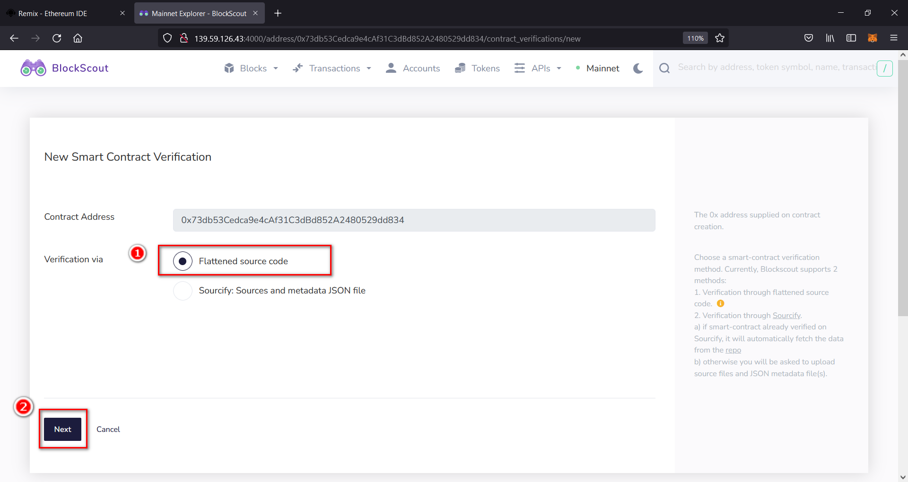
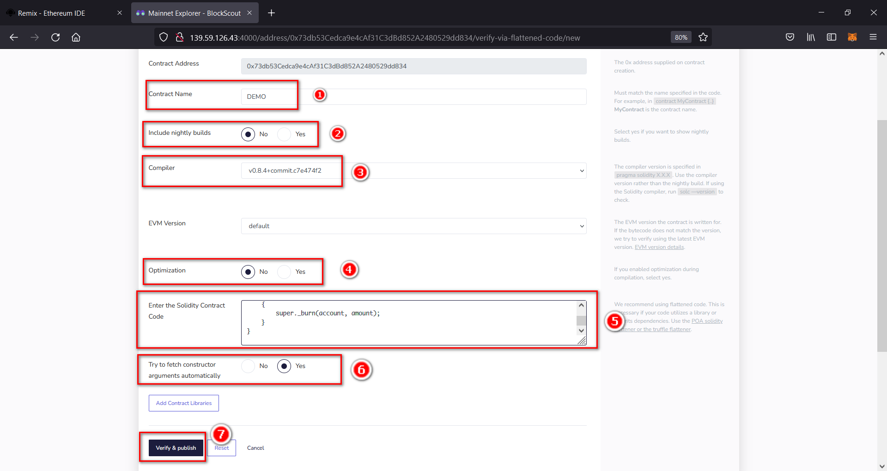
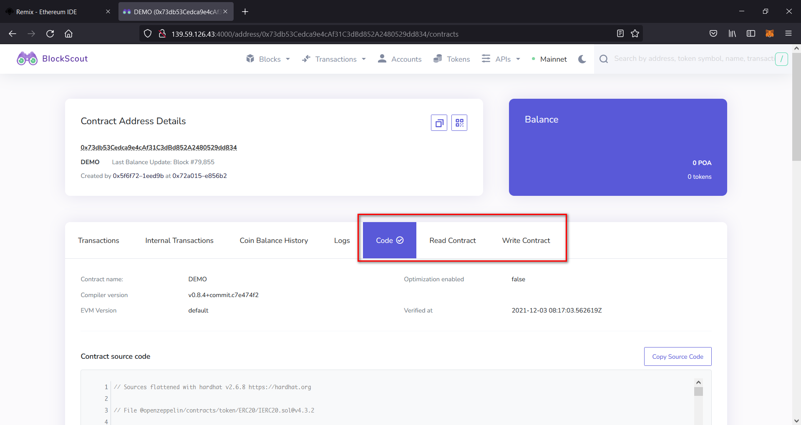
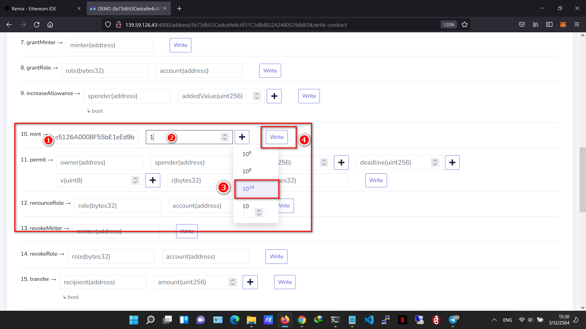
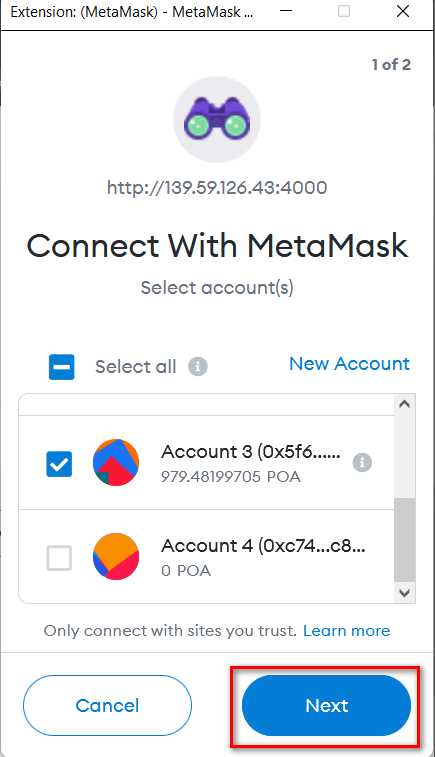
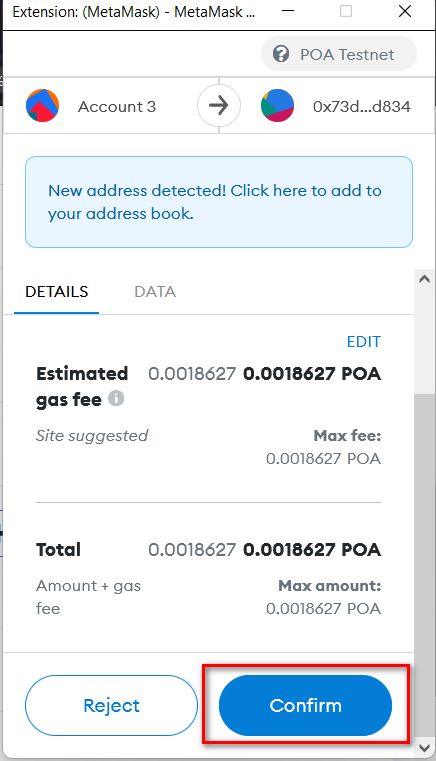
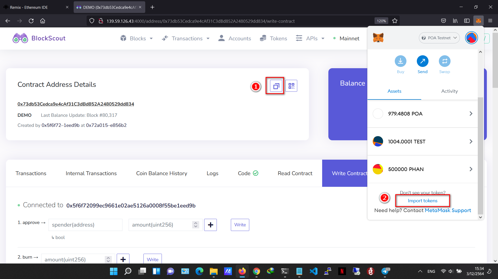
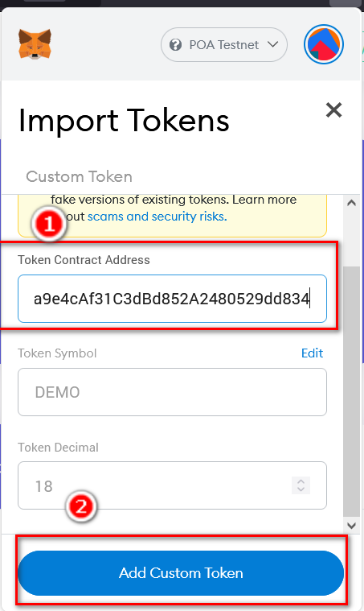

# Demo Samrt Contact Remix 
> https://remix.ethereum.org

## 1. เปิด Remix

## 2. copy code จาก dome.sol
copy source code จากไฟล์ dome.sol ไปวางในกล่องข้อความที่ 5 ตามรูปตัวอย่าง

## 3. Solidity compiler
เลือกเมนู Solidity compiler เลือก version compiler ใน source code ใช้ version 0.8.4

## 4. Deploy & RUN
เลือกเมนู Deploy & run transactions จากนั้นเลือกที่ Environment เลือก Injected Web3 จะมีหน้าต่าง metamask ขึ้นมาให้เลือก account และที่จะ deploy
ต่อมาคือ Contract ให้เลือก Contract DOME - dome.sol และกด Deploy

## 5. Blockscout
ไปที่หน้า blockscout ในตัวอย่าง http://139.59.126.43:4000/ กดเลือกที่ address ของ contact ที่ create ไปเมื่อสักครู่ กด เมนู code --> verify & Publish

หน้า New Smart Contract Verification เลือก  Verification via Flattened source code และกด Next

> Contract Name : DEMO

> Include nightly builds : No

> Compiler : v0.8.4+commit.c7e474f2

> EVM Version : default

> Optimization : No

> Enter the Solidity Contract Code : copy code จากไฟล์ demo.sol มาวาง

> Try to fetch constructor arguments automatically : Yes

> กด Verify & publish

ถ้า verify ผ่านจะมี เพิ่มมาอีก 2 เมนูคือ Read Contact กับ Write Contact

## 6. Mint เหรียญ
เลือก เมนู Write Contact

เลือกที่ข้อ 10 mint 
- receiver (address) คือกระเป๋าที่จะ mint เหรียญ DEMO ไปให้
- amount(uint256) คือ จำนวนเหรียญ ตัวอย่าง ต้องการ 1 เหรียญจะเท่ากับ 1000000000000000000 
กด Write

## 7 Add Token Metamask
copy address ของ DEMO ไปเพิ่มที่ Metamask

